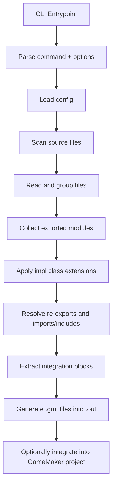

# ScaffScript Contributor Overview

## 1. Purpose and Scope

ScaffScript is a source-to-source compiler and integration tool for a TypeScript-inspired superset of GML. The project focuses on:

1. Scanning `.scaff` and `.gml` files from a configured source tree.
2. Resolving ScaffScript-specific language features such as `export`, `import`, `include`, `impl`, special values, and integration blocks.
3. Generating plain `.gml` output into `.out/`.
4. Optionally integrating the generated output into a GameMaker project by writing resource files and updating the `.yyp` manifest.

This is not a full compiler with an AST-based parser. The current implementation is mostly regex-driven and string-transform-based. Contributors should treat the codebase as a pragmatic build pipeline, not as a formally specified language frontend.

## 2. High-Level Architecture

The runtime path is centered in [`src/cli/main.ts`](../src/cli/main.ts).



## 3. Main Subsystems

### 3.1 CLI

- [`src/index-node.ts`](../src/index-node.ts) and [`src/index-bun.ts`](../src/index-bun.ts) are thin runtime-specific entrypoints.
- [`src/cli/args.ts`](../src/cli/args.ts) validates command-line input and returns a typed command object.
- [`src/cli/main.ts`](../src/cli/main.ts) orchestrates the entire pipeline.

### 3.2 Filesystem and Configuration

- [`src/fs/scan.ts`](../src/fs/scan.ts) loads config and recursively discovers source files.
- [`src/fs/grouping.ts`](../src/fs/grouping.ts) reads file contents, expands special values, and classifies files into processing buckets.

### 3.3 Parsing and Module Resolution

- [`src/parser/export-module.ts`](../src/parser/export-module.ts) extracts exported entities into an internal module store.
- [`src/parser/import-module.ts`](../src/parser/import-module.ts) resolves imports/includes and replaces directive markers with generated GML fragments.
- [`src/parser/class-implement.ts`](../src/parser/class-implement.ts) merges `impl` blocks into class exports.
- [`src/parser/special-value.ts`](../src/parser/special-value.ts) expands compile-time special tokens.

### 3.4 Generation and Integration

- [`src/generator/extract.ts`](../src/generator/extract.ts) parses `#[block]` integration bodies and `intg ... to ...` mappings.
- [`src/generator/write.ts`](../src/generator/write.ts) writes generated `.gml` files under `.out/` and prepares integration metadata.
- [`src/integration/integrate.ts`](../src/integration/integrate.ts) writes to the GameMaker project and optionally prompts for rollback/removal.
- [`src/generator/gm-asset.ts`](../src/generator/gm-asset.ts) contains helper logic for `.yy` and `.yyp` mutations.

### 3.5 Runtime Abstraction

- [`src/runtime/adapter.ts`](../src/runtime/adapter.ts) selects Bun or Node adapters.
- [`src/runtime/node.ts`](../src/runtime/node.ts) and [`src/runtime/bun.ts`](../src/runtime/bun.ts) provide a common minimal FS/prompt interface.

## 4. Suggested Mental Model for Contributors

Work on this project using the following order of understanding:

1. Start from `main()`, because that function defines the real contract between subsystems.
2. Read the file grouping phase before touching parser behavior, because grouping decides which files even reach later stages.
3. Read export/import handling before adding syntax, because most language features are implemented as textual substitutions over the module store.
4. Read integration code before changing output paths, because path semantics are tightly coupled to GameMaker's folder/resource conventions.

## 5. Repository Shape Relevant to Contributors

```text
src/
  cli/           CLI parsing and orchestration
  fs/            config discovery, file scanning, file grouping
  parser/        regex-based language features and module resolution
  generator/     integration extraction and .gml/.yy preparation
  integration/   writeback into GameMaker project structure
  runtime/       Bun/Node abstraction
  utils/         path, logging, fs safety, array helpers
types/           shared internal typing model
tests/           sample sources and project fixtures
.out/            generated output staging area
specs/           contributor-facing project documentation
```

## 6. Current Constraints

The codebase has a few structural realities contributors should not ignore:

1. Parsing is **regex-based**, so syntax additions can have side effects across unrelated patterns.
2. Some GameMaker file edits are line-oriented string mutations rather than full JSON round-tripping.
3. Path handling mixes normalized slash-based strings with native runtime path utilities, so Windows and alias behavior deserves extra care.
4. The project is small enough to move fast, but coupled enough that changes in parser output often affect generator and integration code immediately.
